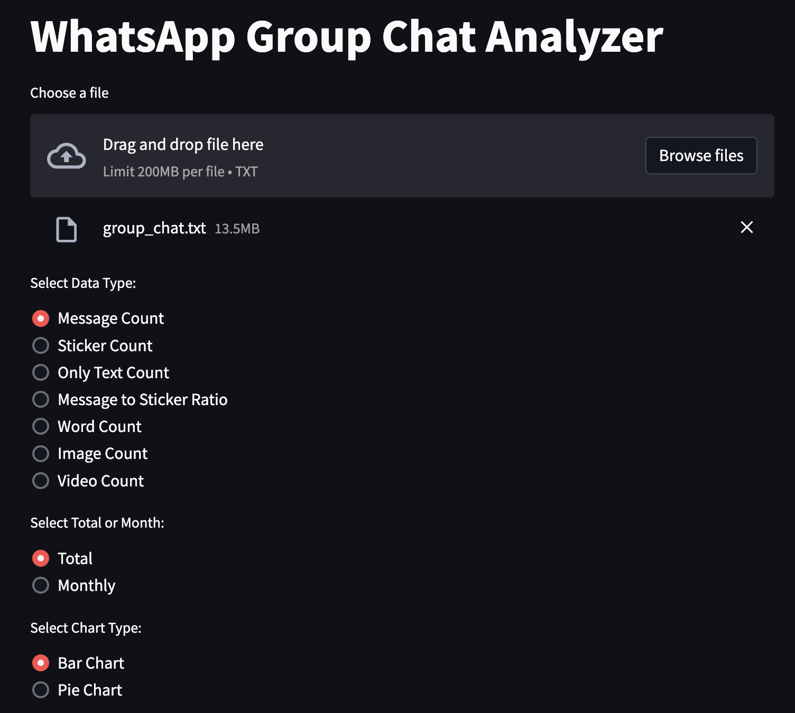
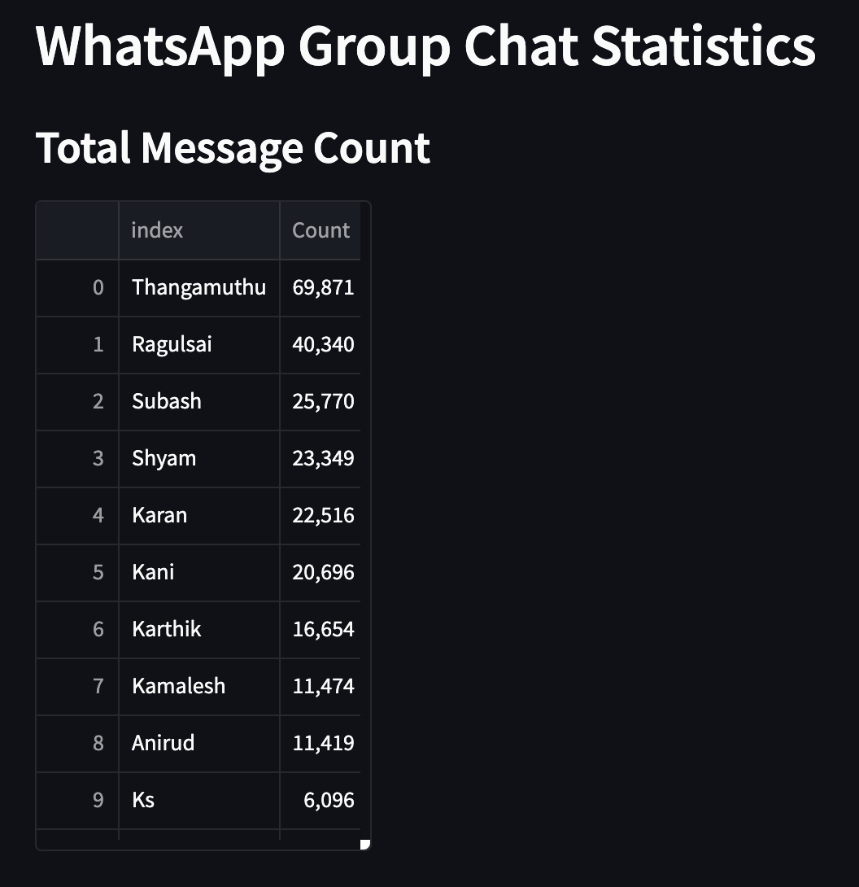
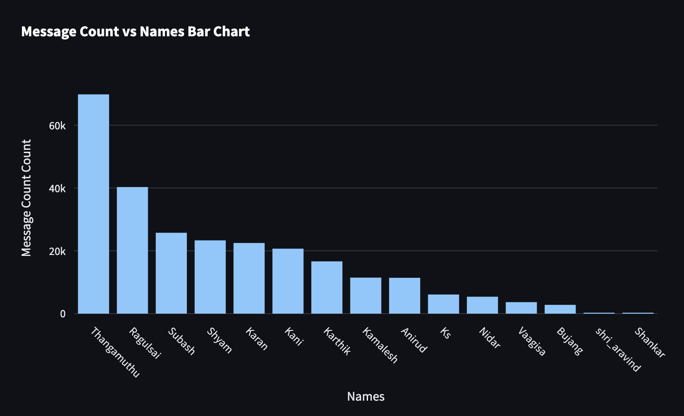
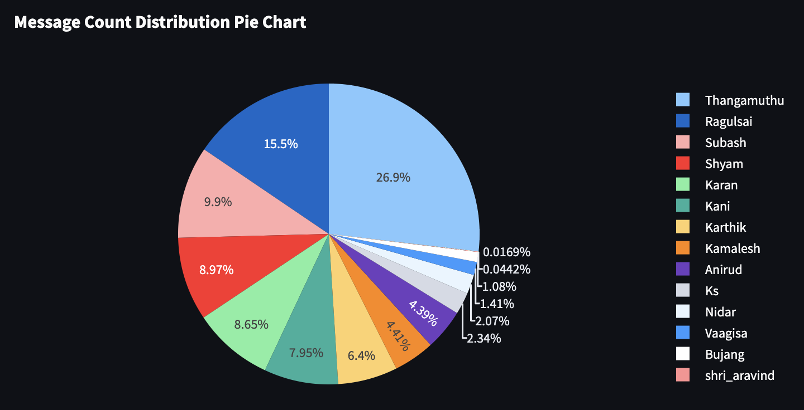

# WhatsApp Group Chat Stats Analyzer Web App

## Overview
WhatsStats is a web application designed to analyze and visualize statistics from your WhatsApp group chat. Whether you're interested in message counts, sticker usage, or specific word occurrences, WhatsStats provides insights into your group conversations.

## Features
- **Message Count:** Get an overview of the total message count in your group chat.
- **Sticker Count:** Analyze the usage of stickers in your conversations.
- **Only Text Count:** Explore the count of messages excluding stickers and media.
- **Message to Sticker Ratio:** Understand the ratio of messages to stickers.
- **Word Count:** Find out how frequently a specific word is used in the chat.

## How to Use
1. **Upload Your Chat:** Choose the WhatsApp group chat export file in TXT format.
2. **Select Data Type:** Choose the type of analysis you want (Message Count, Sticker Count, etc.).
3. **Enter Word (if applicable):** For Word Count analysis, enter the specific word you want to track.
4. **Choose Total or Monthly Data:** Select whether you want data for the entire chat or on a monthly basis.
5. **Select Chart Type:** Choose between Bar Chart and Pie Chart for visual representation.
6. **View Results:** Explore the analyzed data and charts.

## Screenshots

### Home Page


### Message Count


### Bar Graph Analysis


### Bar Graph Analysis


## Dependencies
- Python
- Streamlit
- pandas
- matplotlib
- plotly
- regex

## How to Run Locally
1. Clone the repository.
```bash
git clone https://github.com/Jkanishkha0305/WhatsStats.git
```
2. Install dependencies using
```bash
pip install -r requirements.txt
```
3. Run the app using
```bash
streamlit run app.py
```

Enjoy analyzing your WhatsApp group chat stats with WhatsStats!
